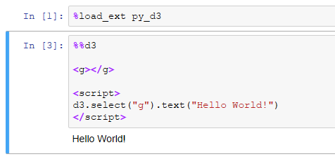
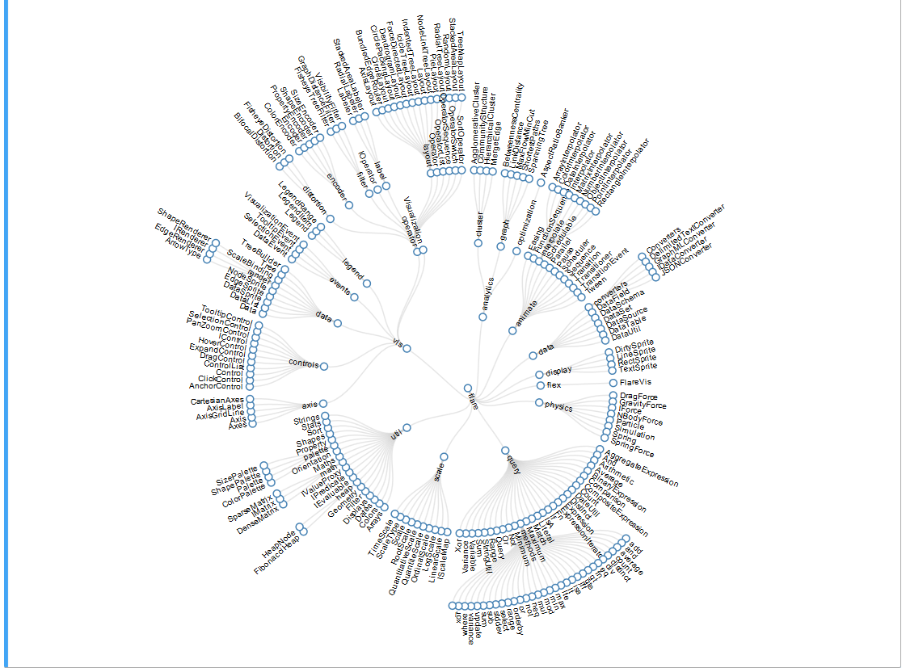
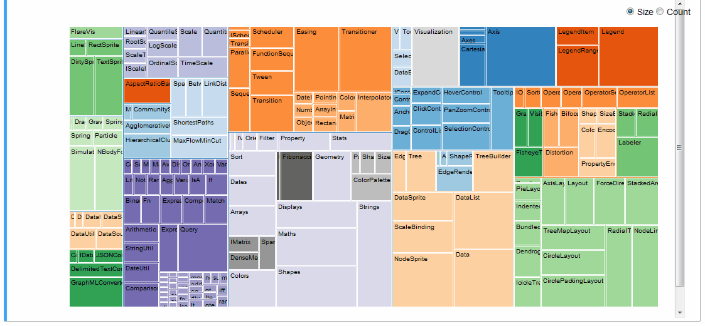

## py_d3   

`py_d3` is an IPython extension which adds D3 support to the Jupyter Notebook environment.

D3 is a powerful JavaScript data visualization library, while Jupyter is an intuitive browser-hosted Python 
development environment. Wouldn't it be great if you could use them together? Now you can.
 
## Quickstart

You can install `py_d3` by running `pip install py_d3`. Then load it into a Jupyter notebook by 
running`%load_ext py_d3`.

Use the `%%d3` [cell magic](http://ipython.readthedocs.io/en/stable/config/extensions/index.html#ipython-extensions) 
to define notebook cells with D3 content.

`py_d3` allows you to express even very complex visual ideas within a Jupyter Notebook without much difficulty.
A [Radial Reingold-Tilford Tree](http://bl.ocks.org/mbostock/4063550), for example:

An interactive treemap ([original](http://bl.ocks.org/mbostock/4063582)):

Or even the entire [D3 Show Reel](https://bl.ocks.org/mbostock/1256572) animation:

For more examples refer to the [examples notebooks](https://github.com/ResidentMario/py_d3/tree/master/notebooks).

## Features

### Configuration

The cell magic will default to loading the latest stable version of D3.JS available online (via 
[CDNJS](https://cdnjs.com/about); `d3@4.13.0` at time of writing). To load a specific version, append the version 
name to the command, e.g. `%%d3 "3.5.17"`. To load D3.JS from a local file pass the filepath, e.g. 
`%%d3 "d3.v5.min.js"`.

Only one version of D3.JS may be loaded at a time. Both `3.x` and `4.x` versions of D3 are supported, but you may 
only run one version of D3 per notebook. You can check which versions are available by running `%d3 versions`, and check which version 
is loaded in the *current* notebook using `%d3 version`. 

### Documentation

Pages from the [D3 API Reference](https://github.com/d3/d3/blob/master/API.md) may be rendered in-notebook using 
`%d3 doc`. For example, you can render the `d3-array` reference by running `%d3 doc "d3-array"`.

## Technical

### How it works

Jupyter notebooks allow executing arbitrary JavaScript code using `IPython.display.JavaScript`, however it makes no 
effort to restrict the level of DOM objects accessible to executable code. `py_d3` works by restricting `d3` scope to
whatever cell you are running the code in, by monkey-patching the `d3.select` and `d3.selectAll` methods (see 
[here](https://github.com/d3/d3/issues/2947) for why this works).

### Porting

Most HTML-hosted D3 visualizations, even very complex ones, can be made to run inside of a Jupyter Notebook `%%d3` cell with just two modifications:

* Remove any D3 imports in the cell (e.g. ``).
* Make sure to create and append to a legal HTML document sub-element. `d3.select("body").append("g")` won't work.

### Contributing

See `CONTRIBUTING.md` for instructions on how to contribute. Pull requests are welcome!